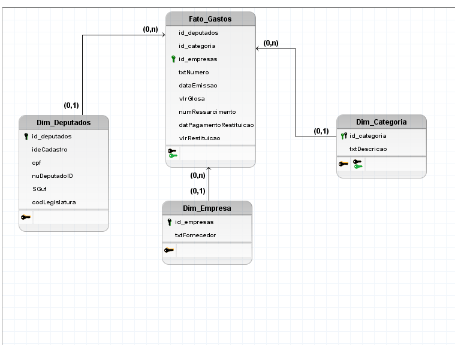

# Deputados - 1ª Versão
[Em Desenvolvimento]

**GitHub do Projeto:** [Deputados-LuhBorba](https://github.com/luhborba/projeto_camara_deputados) 
**Playlist Youtube Codando** :video_camera: [Passo-a-Passo do Projeto - Youtube](https://youtube.com/playlist?list=PL8rfA4a53x0RuhfvfZcW5KtOSOEE0HKUA&si=5Gk2TD2t_hV-u24I)

## Stack do Projeto

- Python
- Pandas
- PySpark
- Jupyter Notebook
- Google Colaboratory
- PGAdmin 4
- PostgreSQL

## Proposta do Projeto

A proposta do Projeto foi realizar um pipeline de dados, para posterior analise desses dados. Assim podendo responder a algumas perguntas:

- Total de Gastos?
- Valor Total Restituído?
- Média de Gastos por Deputado?
- Total Gastos por Estado?
- Total Gastos por Partido?
- Proporção de Gastos de partido por Membro?
- Top 5 Deputados com mais Gastos?
- Top 5 Deputados com menos Gastos?
- Tabela Geral com Informações Gerais?

## Modelagem Dimensional Proposta

> Neste desenho está faltando a coluna sgPartido, dentro da DIM_DEPUTADOS