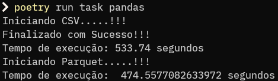
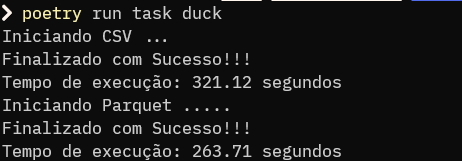

# DuckDB x Pandas

Git do Projeto: [DuckDb](https://github.com/luhborba/duckdb-primeirouso)

A ideia do projeto é gerar dados de acordo com o desejo do usuário, para que possamos simular uma situação real de utilização de dados, para tratamento comparando o desempenho do Pandas e DuckDB

## Regras de Negócio

Para esse projeto o Gestor solicitou que fosse extraido o resultado do total de vendas, como também total de vendas por produtos e por clientes. Para gerar arquivos nos formatos csv e parquet, destas informações para o time de DataViz poder criar incríveis e infaliveis dashboards.

## Estrutura

Basicamente o projeto contém 2 arquivos python, responsáveis pela geração dos dados, e outros arquivos de ETL com python, usando pandas e duckdb;

### gerador.py

O arquivo `gerador.py` é responsável pela função de geração de dados, como também de criação de pastas para armazenar estes dados.

Primeiramente a etapa de importações:

```python
import csv
import os
from random import choice

from faker import Faker
from tqdm import tqdm
```

Criando Estruturas a serem usadas:

```python
# Criando Dicionário de Produtos
lista_produtos = {
    "Computador": 2000,
    "Celular Xiaomi": 1000,
    "Celular Samsung": 1500,
    "Celular Iphone": 5000,
    "Monitor": 700,
    "Teclado": 50,
    "Mouse": 20,
    "HeadSet": 100,
    "HeadSet JBL": 250,
    "Carregador Iphone": 105,
    "Carregador Samsung": 80,
    "Carregador Xiaomi": 90,
    "Carregador Motorola": 100,
    "Carregador Nokia": 110,
    "PenDrive 4 GB": 20,
    "PenDrive 8 GB": 30,
    "PenDrive 16 GB": 40,
}

# Criando Lista de Clientes, para ser possível o controle de quantidade de clientes
cliente = []
```

Iniciando Função de geração:
```python
# Definindo fução para gerar dados
def gerando_dados(
    total_linhas: int, total_clientes: int, nome_arquivo: str, tamanho_bloco: int = 100
):
    # Invocando a biblioteca faker
    falso = Faker()

    # Criando Arquivo
    with open(nome_arquivo, "w", newline="") as file:
        escrever = csv.writer(file)
        escrever.writerow(
            ["Cliente", "Data_Compra", "Produto", "ValorProduto", "Quantidade"]
        )

        # Definindo Lista aleatória de clientes
        for _ in range(total_clientes):
            cliente.append(falso.name())

        # Criando Lista para armazenar os dados
        data = []
        # Interando Barra de Progresso considerando o total de linhas, para gerar dados
        for i in tqdm(range(total_linhas), desc="Progresso", unit="linha"):
            produto = choice(list(lista_produtos.keys()))
            data.append(
                [
                    choice(cliente), # Escolhendo Cliente
                    falso.date(), # Gerando Data Aleatória
                    produto, # Escolhendo Produto previsto na lista
                    lista_produtos[produto], # Escolhendo Valor
                    falso.random_number(1, 10), # Definindo Quantidade
                ]
            )
            
            # Progressão dos dados na Barra
            if i % tamanho_bloco == tamanho_bloco - 1:
                escrever.writerows(data)
                data = []
    
        if data:
            escrever.writerows(data)

    print("Dados gerados com sucesso!")
```

Agora por fim neste arquivo temos a função responsável pela verificação e criação das pastas onde será armazenados os dados:

```python
def criar_pastas(diretorio_atual):
    """
    Cria a estrutura de pastas 'data/csv/' e 'data/parquet/' na pasta atual.

    Args:
      diretorio_atual: Caminho da pasta atual.
    """

    pastas = ["data/csv/", "data/parquet/"]

    for pasta in pastas:
        diretorio_completo = os.path.join(diretorio_atual, pasta)

        # Verifica se o diretório existe
        if not os.path.exists(diretorio_completo):
            # Cria o diretório
            os.makedirs(diretorio_completo)
            print(f"Diretório '{diretorio_completo}' criado com sucesso!")

```

### gerar.py

Agora temos também o arquivo gerar, responsável apenas para chamar as funções do arquivo anterior definindo os parametros:

```python
from gerador import gerando_dados, criar_pastas
import os

gerando_dados(100000000, 20000, "dados.csv")

# Obtém o diretório atual
diretorio_atual = os.getcwd()

# Cria as pastas
criar_pastas(diretorio_atual)
```


### teste01-duck-csv.py (Processo de ETL usando Python + DuckDB, para arquivo CSV)

Script para realizar ETL dos dados e exportar em CSV, utilizando a biblioteca DuckDB

```python
import duckdb
import time

print("Iniciando CSV ...")
# Registrando o tempo de início
inicio = time.time()

# Conectando ao banco de dados DuckDB
con = duckdb.connect()

# Carregando dados
con.execute("CREATE TABLE dados AS SELECT * FROM read_csv('dados.csv');")

# Criando nova coluna de Valor Total
con.execute("ALTER TABLE dados ADD COLUMN ValorTotal DECIMAL(10,2)")
con.execute("UPDATE dados SET ValorTotal = ValorProduto * Quantidade")

# Salvando dados-duck.csv
con.execute("COPY (SELECT * FROM dados) TO 'data/csv/dados-duck.csv'")

# Salvando total_vendas_produtos-duck.csv
con.execute(
    "COPY (SELECT Produto, SUM(ValorTotal) AS TotalVendas FROM dados GROUP BY Produto ORDER BY TotalVendas DESC) TO 'data/csv/total_vendas_produtos-duck.csv'"
)

# Salvando total_vendas_cliente-duck.csv
con.execute(
    "COPY (SELECT Cliente, SUM(ValorTotal) AS TotalVendas FROM dados GROUP BY Cliente ORDER BY TotalVendas DESC) TO 'data/csv/total_vendas_cliente-duck.csv'"
)

# Fechando a conexão com o banco de dados
con.close()

# Registrando o tempo de término
fim = time.time()

# Calculando o tempo de execução
tempo_execucao = fim - inicio

print("Finalizado com Sucesso!!!")
print(f"Tempo de execução: {tempo_execucao:.2f} segundos")

```

### teste02-pd-csv.py (Processo de ETL usando Python + Pandas, para arquivo CSV)

Script para realizar ETL dos dados e exportar em CSV, utilizando a biblioteca Pandas

```python
import pandas as pd
import time
import os


print("Iniciando CSV.....!!!")
# Registrando o tempo de início
inicio = time.time()

# Carregando dados
df = pd.read_csv("./dados.csv")

# Criando nova coluna de Valor Total
df["ValorTotal"] = df["ValorProduto"] * df["Quantidade"]

# Verificando o total de vendas por produtos
total_vendas_produtos = df.groupby("Produto")["ValorTotal"].sum().reset_index()
total_vendas_produtos = total_vendas_produtos.rename(
    columns={"ValorTotal": "TotalVendas"}
)
total_vendas_produtos = total_vendas_produtos.sort_values(
    by="TotalVendas", ascending=False
)


# Verificando o total de vendas por clientes
total_vendas_cliente = df.groupby("Cliente")["ValorTotal"].sum().reset_index()
total_vendas_cliente = total_vendas_cliente.rename(
    columns={"ValorTotal": "TotalVendas"}
)
total_vendas_cliente = total_vendas_cliente.sort_values(
    by="TotalVendas", ascending=False
)

# Salvando DF em CSV
df.to_csv("data/csv/dados-pandas.csv", index=False)

# Salvando DF de Total De Vendas por Produto
total_vendas_produtos.to_csv("data/csv/total_vendas_produtos-pandas.csv", index=False)

# Salvando DF de Total De Vendas por Cliente
total_vendas_cliente.to_csv("data/csv/total_vendas_cliente-pandas.csv", index=False)

# Registrando o tempo de término
fim = time.time()

# Calculando o tempo de execução
tempo_execucao = fim - inicio
print("Finalizado com Sucesso!!!")
print(f"Tempo de execução: {tempo_execucao:.2f} segundos")

```

## Resultado

Ao utilizar o pandas para o tratamento de dados o mesmo desempenho todas o pipeline de dados em aproximadamente 1.008 segundos (Cerca de 16 minutos), exportando os dados tanto em csv, como também em parquet. Conforme imagem abaixo:



Ao utilizar o DuckDB, para realizar o mesmo pipeline de dados ele levou 584,83 segundos (Menos de 10 minutos). Conforme imagem abaixo:



-- **O DuckDB teve uma perfomace 72% melhor do que o Pandas**

## Configuração do Computador Utilizado

- Processador: AMD Ryzen 3 5300U with Radeon Graphics 2.6 Ghz
- RAM: 8 GB DDR-4
- SSD Sata: 256 GB
- SO: Windows 11 23H2

## Stack Utilizada no Projeto

- Python
- Pandas
- Faker
- DuckDB
- Pyarrow
- Fastparquet
- TQDM
- Taskipy
- Mkdocs
