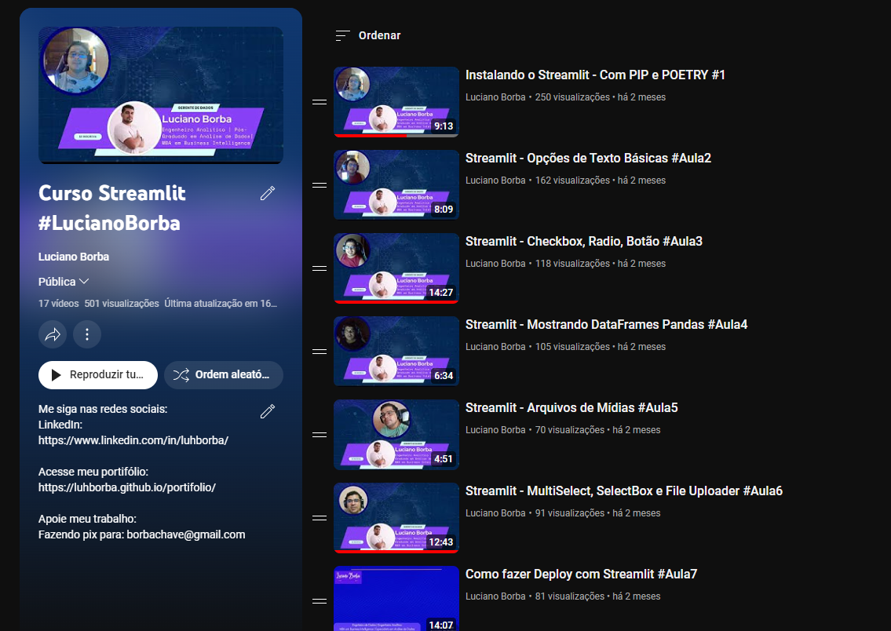
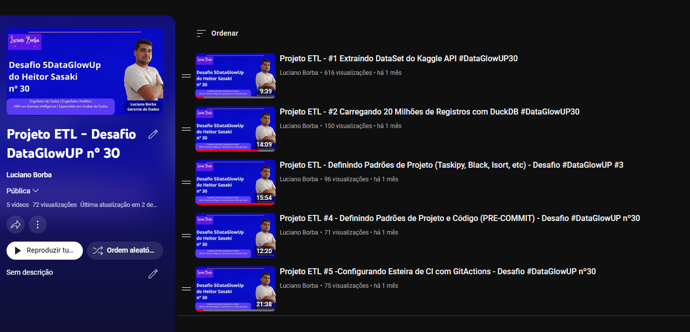
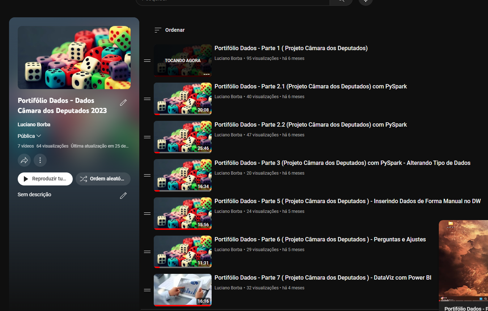

# Canal Youtube

  

    
  

  

    
  

[Link do Canal](https://www.youtube.com/@luhborba)

Eu também estou produzindo conteúdo no Youtube, buscando falar sobre Projetos de Dados, tecnologias envolvidas no mundo de dados, como também um pouco sobre desenvolvimento, para que você possa me conhecer melhor vou contar uma pequena historia.

Eu fui forjado através do conteúdo gratuito, que me formou, me ensinou, me direcionou, através de mentores no Youtube, de alguns mestres que compartilhavam CUPOM de gratuidade em cursos que eles gravaram, os cursos gratuitos da Udemy, os 2 meses free do LinkedIn, usei todo no LinkedIn Learning aprendendo, enfim conteúdo gratuito as vezes pode direcionar a todos nós.

Da aquela forcinha, se inscreva, curta e compartilhe. Espero que esse conteúdo ajude de alguma forma.

## Playlists do Canal

### Curso de Streamlit

[Curso de Streamlit](https://www.youtube.com/playlist?list=PL8rfA4a53x0Q3rnBuWkvYIQvGTj_iZHpb)

### Desafio Data Glow UP nº 30

[Desafio DataGlowUP - Nº 30](https://www.youtube.com/playlist?list=PL8rfA4a53x0Q1FYbZr1VmduivvQceEvnl)

### Projeto Câmara dos Deputados 2023

[Dados Câmara dos Deputados 2023](https://www.youtube.com/playlist?list=PL8rfA4a53x0RuhfvfZcW5KtOSOEE0HKUA)