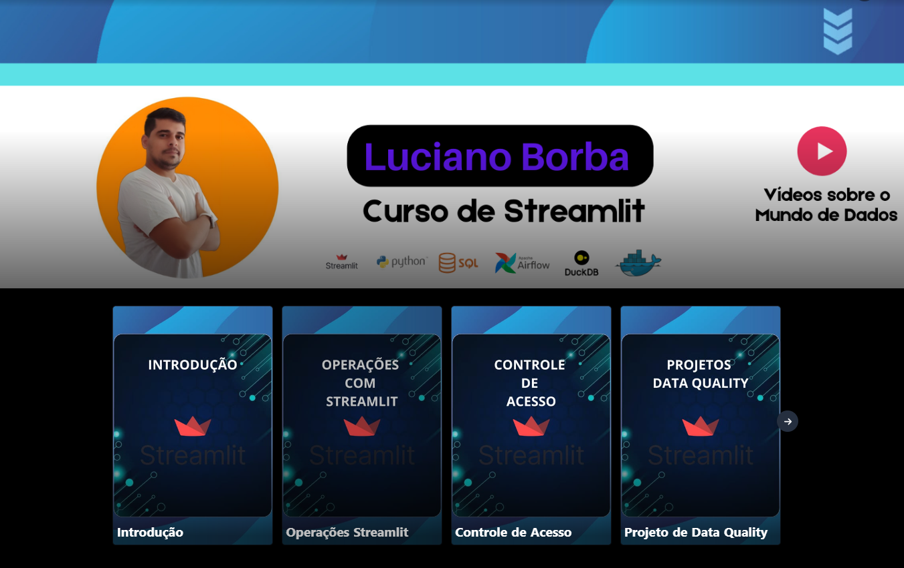

# Cursos Ministrados

Atualmente tenho perfis nas Plataformas de Ensino Kiwify e Udemy, que neste momento contam apenas com um Curso Disponível, mas um dos meus objetivos é gerar conteúdo relevante para os profissionais de dados possam desenvolver suas habilidades durante sua carreira, através de preços acessíveis, como também de cupons de descontos compartilhados frequentemente no meu perfil do LinkedIn.

- Curso de Streamlit são 5 horas de conteúdo sobre esse framework python web, com 1 projeto prático.
- Curso de Engenharia de Dados [Ainda em Desenvolvimento]

## Streamlit - Criando Aplicações Web para Projetos de Dados

[Compre o Curso Clicando Aqui](https://pay.kiwify.com.br/QoAiIte)
- Utilize o CUPOM `LUCIANOBORBA`

### 📊Estatisticas do Curso 👨🏽‍🏫:
✔ Mais de 300 Alunos 
✔ 4,92 de 5 🌟 de Avaliação 
✔ Certificado de conclusão 
✔ Acesso direto ao instrutor 
✔5 Horas de Aprendizado prático 

### ✅Descrição dos módulos do curso 🚀:
- Módulo 1: Introdução 
✔ Apresentação do Instrutor 
✔ Instalação do Streamlit 
✔ Indicação de Conteúdo para Curso 
✔ Liberação de Arquivos usados 

- Módulo 2: Operações Streamlit 
✔ Ensino Passo-a-Passo das principais funções do Framework 

- Módulo 3: Controle de Acesso: 
✔ Ensinando a Utilizar Login/Senha no Streamlit 
✔ Aplicando Metodologia MultiPage com Controle de Acesso 

- Módulo 4: Projeto de DataQuality 
✔ Apresentação do Projeto 
✔ Preparação do Ambiente 
✔ Utilizando TDD 
✔ Contrato de Dados 
✔ Validações de Dados 
✔ Comunicação com Banco de Dados 
✔ Deploy com Docker 

- Módulo 5: Projeto de CRUD com DataViz(Lançamento 20/06) 
✔ Apresentação do Projeto 
✔ Preparação do Ambiente 
✔ Criação de CRUD 
✔ Comunicação com Banco de Dados 
✔ Criação de Dashboards 
✔ Deploy em Cloud  