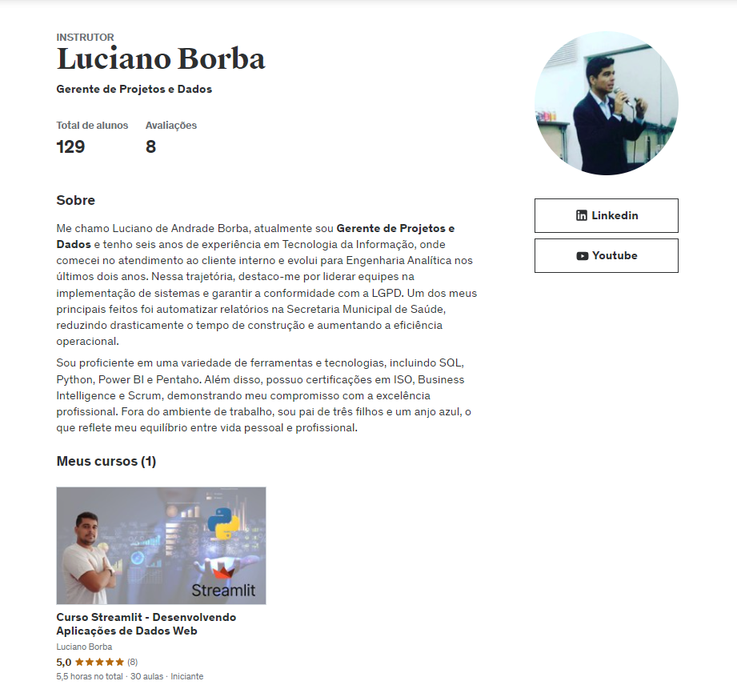
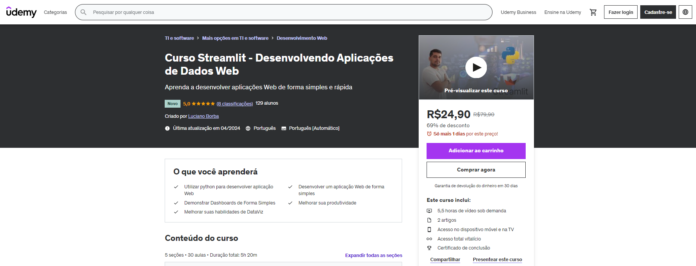

# Cursos

Atualmente tenho perfis nas Plataformas de Ensino Kiwify e Udemy, que neste momento contam apenas com um Curso Disponível, mas um dos meus objetivos é gerar conteúdo relevante para os profissionais de dados possam desenvolver suas habilidades durante sua carreira, através de preços acessíveis, como também de cupons de descontos compartilhados frequentemente no meu perfil do LinkedIn.

- Curso de Streamlit são 5 horas de conteúdo sobre esse framework python web, com 1 projeto prático.
- Curso de Engenharia de Dados [Ainda em Desenvolvimento]

## Curso de Streamlit na Kiwify

[Compre o Curso Clicando Aqui - R$ 30,00](https://pay.kiwify.com.br/QoAiIte)

## Página da Udemy

 
[Acesse Meu Perfil na Udemy](https://www.udemy.com/user/luciano-de-andrade-borba/)

## Página do Curso

[Página do Curso](https://www.udemy.com/course/curso-streamlit-desenvolvendo-aplicacoes-de-dados-web/)