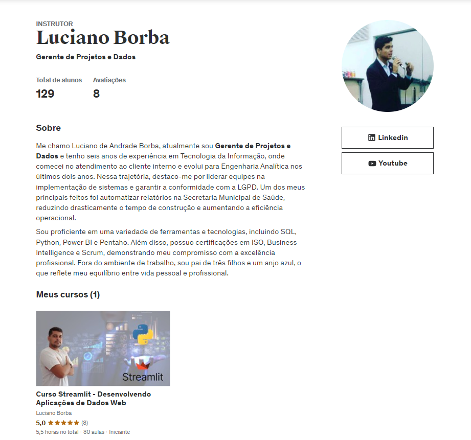

# Udemy

Atualmente tenho um perfil na Udemy, que neste momento conta apenas com um Curso Disponível, mas um dos meus objetivos é gera conteúdo relevante para os profissionais de dados possam desenvolver suas habilidades durante sua carreira, através de preços acessíveis, como também de cupons de descontos compartilhados frequentemente no meu perfil do LinkedIn.

## Página da Udemy

 
[Acesse Meu Perfil na Udemy](https://www.udemy.com/user/luciano-de-andrade-borba/)

## Página do Curso

[Página do Curso](https://www.udemy.com/course/curso-streamlit-desenvolvendo-aplicacoes-de-dados-web/)